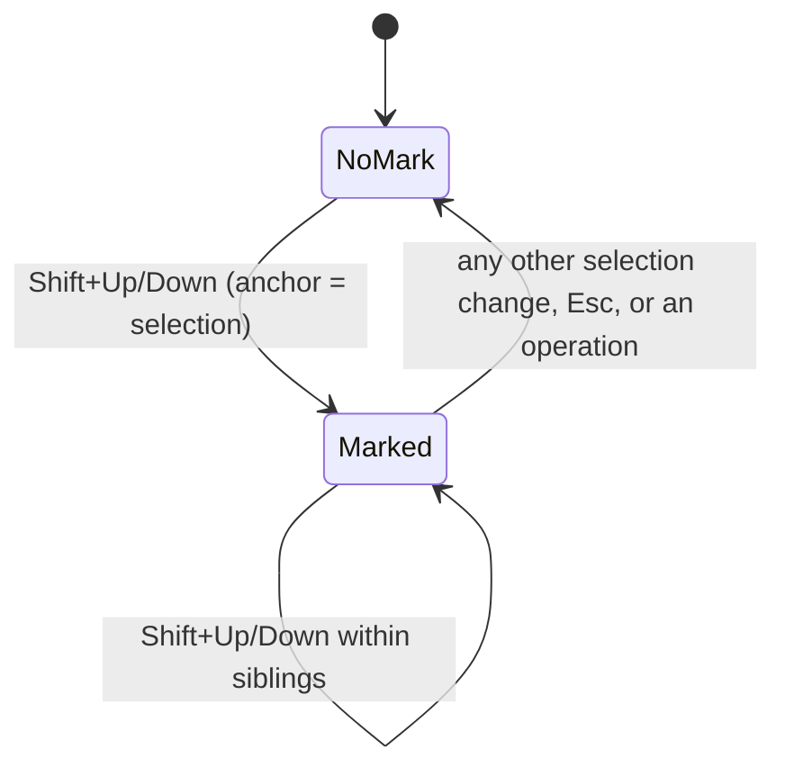

# Implementation Plan: ASN.1 Tree Delete, Copy and Paste

**Branch**: `feat/asn1-tree-delete-copy-paste` | **Date**: 2026-09-09 | **Spec**: [spec.md](spec.md)
**Input**: Feature specification from `kitty-specs/asn1-tree-delete-copy-paste-01M22R1E/spec.md`

## Summary

Add marking of contiguous sibling elements (Shift+Up/Down) to the Structure
pane and delete / cut / copy / paste of whole subtrees, reachable by keys and
through a new Edit menu. Introduce a persisted per-user setting that selects
one of two key-binding sets, *normal* (Ctrl+C/V/X via the system clipboard)
and *vim* (`y`/`p`/`P`/`d` via an in-app element buffer, plus modal editing in
the value editors), edited through a new File ▸ Settings dialog.

Technical approach (confirmed in planning): a key-translation layer turns raw
key events into semantic actions per binding set; the element buffer stores
DER bytes and every paste goes through the existing parser; vim modes wrap the
existing editor operations; settings use a std-only path discovery and a
hand-written TOML-subset parser, adding no crates.

## Technical Context

**Language/Version**: Rust, 2021 edition, stable toolchain (Cargo.toml pins no MSRV; note: `rustup` reports no installed toolchain on this machine — run `rustup default stable` before implementation)
**Primary Dependencies**: ratatui 0.29 (with bundled crossterm) — unchanged; no new crates (decision DM-01M22YBGQX9QXP30582Z3JWY6V)
**Storage**: One per-user settings file, `crex/config.toml` under the OS configuration directory; documents on disk as today
**Testing**: `cargo test` — unit tests in `src/app.rs`, `src/tui.rs` and the new modules using the existing `test_app` helper; integration tests in `tests/` (dumpasn1 compatibility must keep passing)
**Target Platform**: Linux, macOS, Windows terminals (crossterm); Shift+arrow and Ctrl+letter must work on plain terminals without the kitty keyboard protocol
**Project Type**: single binary + library crate (`src/lib.rs` re-exports modules for tests)
**Performance Goals**: mark/delete/copy/paste on 500 elements / 1 MiB within 250 ms including redraw (NFR-001); one `rebuild()` per operation
**Constraints**: additive for normal bindings (C-003); vim table contains no Ctrl+C/V/X/Z (C-002); no GUI/clipboard crate, helper programs only (C-005); settings never written into the working directory (C-006)
**Scale/Scope**: ~6 new app-level operations, 3 new modules (~1 200 lines incl. tests), 3 new dialog/menu modes, help and DESIGN.md updates

## Charter Check

*GATE: Must pass before Phase 0 research. Re-check after Phase 1 design.*

Skipped: no charter exists at `.kittify/charter/charter.yaml`. Built-in
directives consulted instead: DIRECTIVE_001 (separation of concerns → new
modules, TUI stays free of business logic), DIRECTIVE_024 (locality → tree
operations next to insert/delete in `src/app.rs`), DIRECTIVE_010
(specification fidelity → every FR mapped to a concern below), DIRECTIVE_051
(supply chain → no new dependencies; see research.md).

Post-design re-check: no violations. The only structural addition is the
action-translation layer, justified in Complexity Tracking.

## Project Structure

### Documentation (this mission)

```
kitty-specs/asn1-tree-delete-copy-paste-01M22R1E/
├── plan.md              # This file
├── research.md          # Phase 0: decisions and alternatives
├── data-model.md        # Phase 1: Mark, ElementBuffer, Settings, KeyBindingSet, EditorMode
├── quickstart.md        # Phase 1: how to build, try and test the feature
├── contracts/
│   ├── keymap.md            # action ↔ key tables for both binding sets
│   ├── settings-file.md     # file location and format
│   └── clipboard-payload.md # what copy writes and paste accepts
└── tasks.md             # Phase 2 output (/spec-kitty.tasks — NOT created here)
```

### Source Code (repository root)

```
src/
├── keymap.rs        NEW  KeyBindingSet enum, Action enums (TreeAction, EditorAction),
│                         translate(key, set, context) -> Option<Action>, key labels for menus/help
├── settings.rs      NEW  Settings struct, config_path() per OS, load()/save() with the
│                         TOML-subset reader/writer, LoadOutcome for the start-up notice
├── vim.rs           NEW  EditorMode {Normal, Insert, Visual}, VimState, normal-mode command
│                         interpretation over the Editor API, increment/decrement helpers
├── clipboard.rs     MOD  add PEM-armour reading (one or more blocks) to the paste interpretation
├── app.rs           MOD  Mark state; element buffer; mark_extend(); delete/cut/copy/yank of the
│                         operand; paste_before/after/as_child(); PasteWhere dialog; Settings
│                         dialog state; Edit and Settings top-menu entries; help topics
├── tui.rs           MOD  dispatch via keymap actions; mark highlighting in draw_tree;
│                         Edit menu key labels; PasteWhere and Settings dialog rendering;
│                         vim mode indicator in the editor's first line
├── lib.rs           MOD  export keymap, settings, vim
└── main.rs          MOD  load settings before the TUI starts, pass LoadOutcome to App

tests/
└── (existing)       dumpasn1_compat.rs must keep passing; new unit tests live beside the code

DESIGN.md            MOD  §3 architecture list, §7 editing model (mark/buffer/paste), §11 key
                          bindings (two tables), new §11a settings
```

**Structure Decision**: single-crate layout retained. Three new leaf modules
keep the largest file (`src/app.rs`) from growing beyond the tree operations
themselves, and keep `src/tui.rs` a renderer that dispatches on actions rather
than raw keys. Dependency rule extension: `keymap.rs` depends only on
crossterm types; `settings.rs` on std; `vim.rs` on the editor types in
`app.rs` (or on a trait they implement); `app.rs` depends on all three.

## Complexity Tracking

| Violation | Why Needed | Simpler Alternative Rejected Because |
|-----------|------------|-------------------------------------|
| Action-translation layer between key events and handlers | Two binding sets must share one behaviour implementation, the vim table must be provably free of Ctrl+C/V/X/Z, and menus/help need key labels from one source | Branching on the binding set inside every handler duplicates match arms in ~8 handlers and makes C-002 unenforceable by test |

## Key flows

Paste pipeline, shared by every entry point:

```mermaid
flowchart LR
    K[Ctrl+V / p / P / Edit menu] --> S{source}
    S -->|normal bindings| C[system clipboard text]
    S -->|vim bindings or clipboard empty| B[element buffer bytes]
    C --> R[read: hex → base64 → PEM blocks → raw]
    R --> P[parse_forest: whole bytes must be consumed]
    B --> P
    P -->|error| X[status message, no change]
    P -->|nodes| W{where}
    W -->|after / before sibling| I[insert into parent.children]
    W -->|as child| J[insert at parent.children[0]]
    I --> RB[rebuild, dirty, select first pasted]
    J --> RB
```

Mark lifecycle in the tree:



## Implementation Concern Map

### IC-01 — Key-binding sets and action translation

- **Purpose**: One place that maps raw key events to semantic actions for the normal and vim sets, so handlers, menus and help share it and C-002 is testable.
- **Relevant requirements**: FR-021 (labels), FR-025, FR-027, FR-033, C-001, C-002, C-003
- **Affected surfaces**: `src/keymap.rs` (new), `src/tui.rs` (handle_document_key, handle_edit_key dispatch on actions), `src/lib.rs`
- **Sequencing/depends-on**: none
- **Risks**: Shift+Up may arrive as `KeyCode::Up` with the SHIFT modifier or, on some terminals, as a distinct escape sequence crossterm already normalises; test both forms. Ctrl+letter arrives upper- or lower-case depending on terminal (fold as `handle_edit_key` does today).

### IC-02 — Settings persistence and start-up loading

- **Purpose**: Remember the chosen binding set across runs without new dependencies and without ever blocking start-up.
- **Relevant requirements**: FR-022, FR-023, NFR-004, C-005, C-006, C-007
- **Affected surfaces**: `src/settings.rs` (new), `src/main.rs` (load before TUI), `src/app.rs` (Notice on unreadable file)
- **Sequencing/depends-on**: IC-01 for the `KeyBindingSet` type
- **Risks**: Windows path via `APPDATA`, macOS via `HOME/Library/Application Support`, Linux via `XDG_CONFIG_HOME` then `HOME/.config`; when none is set, settings are in-memory only and the dialog says so. Write via temp file + rename so a crash never truncates the file.

### IC-03 — Mark model and highlighting

- **Purpose**: Represent and display a contiguous sibling range anchored at the selection.
- **Relevant requirements**: FR-001..FR-006, edge cases on filter, collapsed nodes, anchor crossing
- **Affected surfaces**: `src/app.rs` (Mark struct, `mark_extend(delta)`, `clear_mark()`, `operand()`), `src/tui.rs` (`draw_tree` row style for marked rows)
- **Sequencing/depends-on**: IC-01 (MarkUp/MarkDown actions)
- **Risks**: Row indices change on rebuild; store the mark as `(RowSource, parent path, anchor index, active index)` and derive rows, never the reverse. Refuse marking while `filter` is non-empty. Every selection-changing method must call `clear_mark()`; a test iterates over the navigation methods to enforce it.

### IC-04 — Element buffer, delete / cut / copy / yank of the operand

- **Purpose**: Turn the operand into DER bytes once and share them between the clipboard and the in-app buffer; extend the two-step delete to ranges.
- **Relevant requirements**: FR-006..FR-010, FR-020, FR-026, NFR-003
- **Affected surfaces**: `src/app.rs` (`element_buffer: Option<ElementBuffer>`, `delete_operand()` replacing the body of `delete_selected`, `copy_operand()`, `cut_operand()`, `yank_operand()`), `src/clipboard.rs` (`write` reuse)
- **Sequencing/depends-on**: IC-03
- **Risks**: Deleting a range must remove indices from high to low; cut must copy before removing and abort when neither destination accepted the data. Confirmation text must state the element count. Cursor placement rule (FR-008) shared by delete and cut.

### IC-05 — Paste pipeline and placement

- **Purpose**: Read bytes from clipboard or buffer, validate them as a complete forest, insert before/after/as child, with the before/after dialog for first siblings under normal bindings.
- **Relevant requirements**: FR-011..FR-019, NFR-002, C-004, C-008
- **Affected surfaces**: `src/clipboard.rs` (PEM block reading, `PasteKind::Pem`), `src/app.rs` (`paste_bytes(where)`, `PasteWhere` enum, `Mode::PasteWhere(MenuState)`), `src/tui.rs` (dialog rendering reusing the popup menu)
- **Sequencing/depends-on**: IC-04 (buffer), IC-01 (actions)
- **Risks**: Region rules must be checked before mutation (reuse the checks in `start_insert`). Pasted nodes come from `parse_forest` with offsets relative to the pasted bytes; `rebuild()` recomputes them. Collapsed parent must be expanded so the pasted rows are visible (as insert does).

### IC-06 — Edit menu, File ▸ Settings entry and dialogs

- **Purpose**: Make every tree operation discoverable and provide the only route to Paste as child; let users change the binding set in-app.
- **Relevant requirements**: FR-014, FR-021, FR-024, NFR-005
- **Affected surfaces**: `src/app.rs` (`TOP_MENUS` Edit heading, `TopMenuAction` variants, `Mode::Settings(SettingsState)`), `src/tui.rs` (menu key labels from keymap, settings dialog with radio rows like the public-key dialog)
- **Sequencing/depends-on**: IC-01, IC-02, IC-04, IC-05
- **Risks**: `TOP_MENUS` is a `const` with static labels; key labels must be computed at draw time from the active set rather than baked into the const.

### IC-07 — Vim modal value editors

- **Purpose**: Give the value editors normal/insert/visual modes under vim bindings, mapping commands onto the existing Editor operations, plus increment/decrement.
- **Relevant requirements**: FR-027..FR-031, US6 scenarios
- **Affected surfaces**: `src/vim.rs` (new), `src/app.rs` (`EditState.vim: Option<VimState>`, editor buffer, `increment_at_cursor(delta)` on `Editor`), `src/tui.rs` (`handle_edit_key` routes through vim when active; mode indicator)
- **Sequencing/depends-on**: IC-01
- **Risks**: The DateTime editor is field-based, not a char buffer; `h`/`l` map to field changes and `x` is a no-op there. Increment on the integer editor must accept arbitrary size (string arithmetic, not i128). Hex octet increment must wrap.

### IC-08 — Documentation and documentation tests

- **Purpose**: Keep the help window and DESIGN.md truthful for both binding sets and verify it mechanically.
- **Relevant requirements**: FR-032, NFR-005, SC-007
- **Affected surfaces**: `src/app.rs` (`HELP_TOPICS`), `DESIGN.md` (§3, §7, §11, new §11a), README key summary if present
- **Sequencing/depends-on**: IC-01..IC-07 (final wording)
- **Risks**: A test that every `TreeAction` variant's label appears in some help topic body catches omissions.

## Test strategy

- App-level unit tests (existing `test_app(bytes)` helper) for: mark extend/shrink/bounds/anchor crossing/filter refusal; range delete with confirmation; copy → paste round trip byte-identical (NFR-002, SC-003); paste refusal on truncated/odd-hex/bad-base64 input leaves `dirty == false` (NFR-003); paste before/after/child placement and cursor; region-rule refusals; cut abort when no destination.
- `keymap` tests: vim table has no CONTROL+{c,v,x,z} entries (C-002); every action reachable in both sets or documented as menu-only; both Shift+Up encodings translate to MarkUp.
- `settings` tests: path per OS from env vars (set in-test); round trip; unknown keys preserved on save; malformed file → `LoadOutcome::Invalid` with message; missing file → defaults silently.
- `vim` tests: mode transitions; `v` `l` `l` `y` `$` `p` on the hex editor duplicates three octets; Ctrl+A on octet FF wraps to 00; on integer 99 gives 100; on OID arc.
- Documentation test: each action label found in `HELP_TOPICS`.
- Performance smoke test (ignored by default): 500-element forest mark + delete under 250 ms.

## Definition of done for planning

All Decision Moments resolved (`decision verify` clean), research.md answers
every open design question, data-model.md and contracts written, quickstart
runnable. Next: `/spec-kitty.tasks`.
