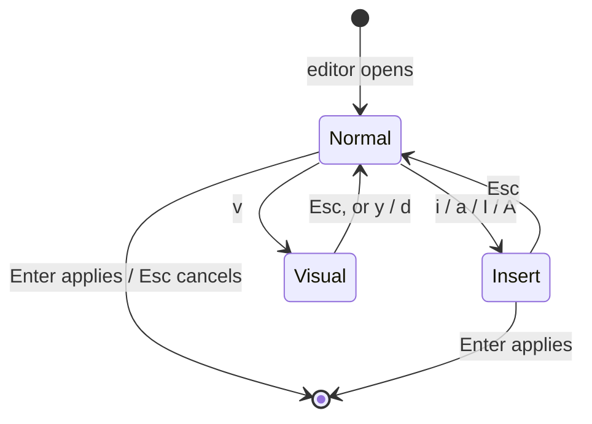

# Mission Specification: ASN.1 Tree Delete, Copy and Paste

**Mission Branch**: `feat/asn1-tree-delete-copy-paste`
**Created**: 2026-09-09
**Status**: Draft
**Input**: User description: "We add delete, copy, and paste functions in the ASN.1 tree. Shift+(up|down) is used to mark elements."

## Intent Summary *(confirmed in discovery)*

A crex user editing a BER/DER document in the Structure pane wants to remove,
duplicate or relocate groups of ASN.1 elements without retyping them. Today the
tree only deletes or inserts one element at a time, and copy/paste exists only
inside the value editors. This mission adds:

- **Marking** of a contiguous run of sibling elements with Shift+Up/Down.
- **Delete, cut, copy and paste** of the marked (or selected) elements, as
  whole subtrees, reachable both by key and through a new **Edit** menu in the
  top bar.
- A persisted **key-binding setting** with two sets, *normal* (Ctrl+C / Ctrl+V
  through the system clipboard) and *vim* (`y` / `p` / `P` / `d` through an
  in-app buffer), chosen in a new **File ▸ Settings** dialog. The vim set also
  gives the value editors vim-style modal editing.

Discovery decisions are recorded in `decisions/` (marking scope, key
bindings and clipboard storage, depth of vim emulation).

## Domain Language *(canonical terms)*

| Term | Meaning | Avoid |
|------|---------|-------|
| **Structure pane** | The pane showing the open document as a tree of ASN.1 elements. | "tree view", "ASN.1 panel" |
| **Element** | One ASN.1 node in the Structure pane: its identifier, length and content octets, including all descendants when constructed. | "node", "item" |
| **Sibling** | An element with the same parent as another element. Top-level elements are siblings of each other. | — |
| **Constructed element** | An element whose content is itself a list of elements (SEQUENCE, SET, explicit tags, encapsulating strings). | "container" |
| **Selection** | The single element under the cursor in the Structure pane. Always exists in a non-empty document. | "current node" |
| **Mark** / **marked range** | A contiguous run of siblings, anchored at the element selected when marking began and extended with Shift+Up/Down. A marked constructed element implicitly includes its subtree. | "selection range", "multi-select" |
| **Operand** | What an edit operation acts on: the marked range if a mark exists, otherwise the selection. | — |
| **Element buffer** | The in-app store holding the last copied, cut or deleted elements. Survives until crex exits or the buffer is replaced. | "register", "internal clipboard" |
| **System clipboard** | The desktop clipboard reached through the helper programs crex already uses. | — |
| **Key-binding set** | One of two named layouts, **normal** or **vim**, selected in Settings. | "key map", "mode" (reserved for editor modes) |
| **Value editor** | Any editor opened with `e` / `E` on an element: hex, base64, raw, integer, OID, text, boolean, date/time. | "content editor" |
| **Editor mode** | Under vim bindings, one of *normal*, *insert* or *visual* inside a value editor. | — |
| **Settings** | The per-user configuration crex remembers between runs, currently the key-binding set. | "preferences", "options", "config" (in user-facing text) |

## User Scenarios & Testing *(mandatory)*

### User Story 1 - Mark and delete a run of siblings (Priority: P1)

A user opens a certificate whose Extensions SEQUENCE holds twelve extensions
and wants to remove five adjacent ones. They select the first of the five,
press Shift+Down four times so all five are highlighted, press `d`, read the
confirmation line "delete 5 elements …? press d again to confirm", and press
`d` again. The five extensions vanish, the document is marked modified, and
Ctrl+S writes it.

**Why this priority**: Deleting groups is the most requested operation and the
one that today costs the most keystrokes (two per element plus navigation).
It also introduces the marking model every other story builds on.

**Independent Test**: Open any document with a constructed element holding
at least three children, mark two of them, delete, save, reopen and confirm
exactly those two are gone and the rest is byte-identical.

**Acceptance Scenarios**:

1. **Given** an element with siblings below it is selected and no mark exists, **When** the user presses Shift+Down, **Then** the selected element and its next sibling are both shown as marked and the cursor stands on the next sibling.
2. **Given** a mark of three siblings with the cursor at its lower end, **When** the user presses Shift+Up, **Then** the mark shrinks to two siblings.
3. **Given** the cursor stands on the last sibling of its parent with a mark active, **When** the user presses Shift+Down, **Then** the mark does not change and the status line says the mark cannot extend past the parent's last element.
4. **Given** a mark spanning constructed elements, **When** the user presses `d` twice, **Then** all marked elements and everything under them are removed, the document is marked modified, and the cursor stands on the element that followed the mark (or the preceding one at the end of the parent, or the parent when none remain).
5. **Given** a mark exists, **When** the user presses a plain cursor key, Esc, or any key that changes the selection, **Then** the mark is cleared.
6. **Given** the user presses `d` once with a mark active and then moves the cursor, **When** they press `d` again, **Then** nothing is deleted; the confirmation must be re-armed.
7. **Given** a mark is active in a document opened read-only for the tree region (a decrypted placeholder, an elided row, a revealed CMS region), **When** the user tries to mark or delete, **Then** the operation is refused with the same wording the single-element delete uses today.

---

### User Story 2 - Copy and paste elements under normal bindings (Priority: P1)

A user wants to copy the `subjectAltName` extension from one certificate
into another. In the first document they select the extension and press
Ctrl+C. The status line confirms "1 element copied to the clipboard as hex".
They open the second document, select the extension after which it should
go, press Ctrl+V, and the extension appears there as a new sibling with the
cursor on it.

**Why this priority**: Copy/paste is the second half of the headline feature
and is what makes the work reusable across documents and tools.

**Independent Test**: Copy an element, paste it after another element in the
same document, save, and verify the pasted encoding is byte-identical to the
source encoding.

**Acceptance Scenarios**:

1. **Given** an operand of one or more elements, **When** the user presses Ctrl+C, **Then** the DER encoding of the operand elements, concatenated in tree order, is placed on the system clipboard as hex text and in the element buffer; the status line names how many elements were copied.
2. **Given** the system clipboard cannot be written, **When** the user presses Ctrl+C, **Then** the element buffer still receives the elements and the status line says the clipboard was unavailable and that pasting within crex still works.
3. **Given** the clipboard holds hex text, base64 text, PEM-armoured text, or raw bytes that decode to one or more complete BER/DER elements, **When** the user presses Ctrl+V on an element that is not the first of its siblings, **Then** the decoded elements are inserted after the selection as siblings, the cursor moves to the first pasted element, the document is marked modified, and the status line says how many elements were pasted and how the clipboard text was read (hex, base64, PEM, raw).
4. **Given** the selection is the first of its siblings (including the sole top-level element), **When** the user presses Ctrl+V, **Then** a small dialog asks whether to paste *before* or *after* the selection; Enter on the choice pastes, Esc pastes nothing.
5. **Given** the clipboard content does not decode to a whole number of complete elements (trailing bytes, truncated length, empty content), **When** the user presses Ctrl+V, **Then** nothing changes and the status line explains why the content was refused.
6. **Given** the system clipboard is empty or unavailable but the element buffer holds elements, **When** the user presses Ctrl+V, **Then** the element buffer is pasted and the status line says so.
7. **Given** the selection is inside a decrypted PKCS#8 or PKCS#12 region at its top level, **When** the user pastes before or after it, **Then** the paste is refused with the same wording the insert action uses for that region.
8. **Given** the pasted elements were indefinite-length BER, **When** the document is saved, **Then** they are written with definite lengths like everything else.

---

### User Story 3 - The Edit menu (Priority: P2)

A user who does not remember the keys opens the top bar, moves to the new
**Edit** heading and sees Delete, Cut, Copy, Paste before, Paste after and
Paste as child, each with a one-line description and the key that triggers it
in the active binding set (or "menu only" for Paste as child). They select
an empty SEQUENCE, choose **Paste as child**, and the buffered elements
appear inside it.

**Why this priority**: The menu makes the operations discoverable and is the
only way to paste into an empty constructed element.

**Independent Test**: Insert an empty SEQUENCE, copy any element, run Edit ▸
Paste as child on the SEQUENCE, and verify the element is now its only child.

**Acceptance Scenarios**:

1. **Given** the top bar is open, **When** the user moves to Edit, **Then** the drop-down lists exactly Delete, Cut, Copy, Paste before, Paste after, Paste as child, in that order, each showing the key for the active binding set where one exists.
2. **Given** a constructed element is selected, **When** the user runs Edit ▸ Paste as child, **Then** the buffered or clipboard elements become its first children and the cursor moves to the first pasted element.
3. **Given** a primitive element is selected, **When** the user runs Edit ▸ Paste as child, **Then** the action is refused and the status line suggests Paste before/after instead.
4. **Given** an operand exists, **When** the user runs Edit ▸ Cut, **Then** the operand is copied exactly as Copy does and then removed without a further confirmation; if the copy could not reach either the clipboard or the element buffer, nothing is removed.
5. **Given** an operand exists, **When** the user runs Edit ▸ Delete, **Then** the two-step confirmation is armed exactly as pressing `d` would.
6. **Given** Paste before or Paste after is run from the menu, **When** the selection is the first sibling, **Then** no before/after dialog appears because the menu entry already states the position.

---

### User Story 4 - Choosing and remembering key bindings (Priority: P2)

A vim user opens File ▸ Settings, sees a two-way choice "Key bindings:
normal / vim" with the location of the settings file underneath, picks vim,
presses Enter, and immediately `y`, `p` and the modal editors are live. On the
next start crex comes up with vim bindings without being told.

**Why this priority**: The two binding sets only make sense if the choice
persists; without this story the vim set is unreachable.

**Independent Test**: Switch to vim in Settings, quit, restart, and confirm
`y` yanks in the tree and the help window shows the vim key table.

**Acceptance Scenarios**:

1. **Given** no settings file exists, **When** crex starts, **Then** it uses normal bindings and does not show any warning.
2. **Given** the settings file exists but cannot be read or parsed, **When** crex starts, **Then** it uses normal bindings and shows a dismissible notice naming the file and the problem.
3. **Given** the Settings dialog is open, **When** the user changes the key-binding set and confirms, **Then** the new set applies at once to the tree, the menus, the help window and any editor opened afterwards, and the file is written; if writing fails, the set still applies for this run and the status line reports the failure.
4. **Given** the Settings dialog is open, **When** the user presses Esc, **Then** nothing changes and nothing is written.
5. **Given** the settings file is stored, **When** the user looks for it, **Then** it is in the OS-typical per-user configuration location (the XDG configuration directory on Linux, the user's Application Support directory on macOS, the roaming application-data directory on Windows), never in the working directory or next to the opened files.
6. **Given** the File menu is open, **When** the user reads it, **Then** it lists New DER, Save and Settings.

---

### User Story 5 - Yank, paste and delete under vim bindings (Priority: P2)

With vim bindings active, a user selects three sibling elements with
Shift+Down twice, presses `y`, moves to another parent's child, and presses
`p` to paste them after it, or `P` to paste them before it. Pressing `d` twice
on a mark deletes it and, as in vim, leaves the deleted elements in the
element buffer so `p` can bring them back elsewhere.

**Why this priority**: Delivers the second binding set for the tree; depends
on stories 1 and 4.

**Independent Test**: Under vim bindings, `y` on an element, move, `P`, save,
and verify the copy sits before the target and is byte-identical.

**Acceptance Scenarios**:

1. **Given** vim bindings and an operand, **When** the user presses `y`, **Then** the operand's elements go to the element buffer only, the mark is cleared, and the status line says how many elements were yanked.
2. **Given** vim bindings and a non-empty element buffer, **When** the user presses `p`, **Then** the buffered elements are inserted after the selection as siblings; **When** the user presses `P`, **Then** they are inserted before the selection. No before/after dialog appears in either case.
3. **Given** vim bindings, **When** the user completes a two-step `d` on an operand, **Then** the elements are removed and also placed in the element buffer, replacing its previous content.
4. **Given** vim bindings, **When** the user presses Ctrl+C or Ctrl+V in the Structure pane, **Then** nothing happens; the vim set holds no normal-set bindings.
5. **Given** vim bindings and an empty element buffer, **When** the user presses `p` or `P`, **Then** nothing changes and the status line says the buffer is empty.

---

### User Story 6 - Modal editing in the value editors under vim bindings (Priority: P3)

With vim bindings, a user presses `e` on an INTEGER. The editor opens in
normal mode showing the value with a block cursor. They press Ctrl+A three
times to increment it, `$` to jump to the end, `a` to append, type two digits,
press Esc to return to normal mode and Enter to apply. In the hex editor they
press `v`, move with `l` to mark three octets, `d` to delete them into the
editor's own buffer, `p` to put them back after the cursor, and `u` to undo.

**Why this priority**: Rounds out the vim experience but is independent of
the tree operations; the tree and settings stories deliver value without it.

**Independent Test**: Under vim bindings open the hex editor, perform `v`
`l` `l` `y` `$` `p` Enter, save, and verify the three octets were duplicated
at the end of the content.

**Acceptance Scenarios**:

1. **Given** vim bindings, **When** any value editor opens, **Then** it starts in normal mode and the first line shows the mode name alongside the existing live feedback.
2. **Given** normal mode, **When** the user presses `i`, `a`, `I` or `A`, **Then** the editor enters insert mode with the cursor respectively at, after, at the start of, or at the end of the current position; typed characters are inserted exactly as they are today.
3. **Given** insert mode, **When** the user presses Esc, **Then** the editor returns to normal mode without applying or discarding the edit.
4. **Given** normal mode, **When** the user presses `h`, `l`, `j`, `k`, `0` or `$`, **Then** the cursor moves one position left/right, one row up/down (hex editor rows; no-op in single-line editors), or to the start/end of the content.
5. **Given** normal mode, **When** the user presses `x`, **Then** the character (octet in the hex editor) under the cursor is removed and placed in the editor buffer.
6. **Given** normal mode, **When** the user presses `v` and then motion keys, **Then** a visual selection grows exactly as Shift+cursor selection does under normal bindings; `y` copies it into the editor buffer, `d` removes it into the editor buffer, and Esc leaves visual mode.
7. **Given** normal mode and a non-empty editor buffer, **When** the user presses `p` / `P`, **Then** the buffered content is inserted after / before the cursor, shown as newly added content like a paste is today.
8. **Given** normal mode, **When** the user presses `u`, **Then** one change is undone exactly as Ctrl+Z does under normal bindings.
9. **Given** normal mode, **When** the user presses Ctrl+A / Ctrl+X, **Then** the number at or after the cursor is incremented / decremented by one: the octet under the cursor in the hex editor (wrapping FF→00 and 00→FF), the whole value in the integer editor, the arc under the cursor in the OID editor, and the run of decimal digits at or after the cursor in text and date/time editors. When no number is found the status line says so.
10. **Given** normal mode, **When** the user presses Enter, **Then** the edit is applied as it is today; **When** the user presses Esc, **Then** the edit is cancelled. **Given** insert mode, **When** the user presses Enter, **Then** the edit is applied.
11. **Given** vim bindings, **When** the user presses Ctrl+C, Ctrl+V or Ctrl+Z in any editor mode, **Then** nothing happens.
12. **Given** normal bindings, **When** any value editor opens, **Then** it behaves exactly as it does today (typing immediately, Shift-selection, Ctrl+A/C/X/V/Z).

Editor modes under vim bindings:

---

### Edge Cases

- **Marking on the last/first sibling**: Shift+Down on the last sibling (or Shift+Up on the first) leaves the mark unchanged and reports why.
- **Marking with a tree filter active**: marking is refused while the filter hides elements, because a mark of "contiguous siblings" could silently include hidden ones. Single-element operations keep working while filtered.
- **Mark spanning a collapsed constructed element**: the collapsed element is marked as a whole; its hidden subtree is part of the operand.
- **Mark that reaches the anchor from the other side**: Shift+Up past the anchor extends the mark upward; the anchor is never dropped from the mark.
- **Deleting all children of a constructed element**: allowed; the parent remains as an empty constructed element and the cursor moves to it.
- **Deleting the whole top level**: allowed; the document becomes empty with the same status wording the single delete uses.
- **Pasting into an empty document**: Paste after/before/as child all insert the elements as the new top level.
- **Paste that would break a region invariant**: a decrypted PKCS#8 value or a decrypted PKCS#12 region must remain one top-level SEQUENCE; paste before/after at that level is refused exactly as insert is.
- **Clipboard text that is hex but odd-length**, or base64 with bad padding, or PEM with mismatched labels: refused with a message naming the reading that was attempted.
- **Clipboard with several PEM blocks**: each block is decoded and the elements of all blocks are pasted in order.
- **Very large clipboard content** (e.g. a whole PKCS#12 file): pasted if it decodes; performance must stay within NFR-001.
- **Cut whose copy fails everywhere**: nothing is removed.
- **Settings file writable but directory missing**: the directory is created; if that fails the failure is reported and the setting still applies for the session.
- **Editor opened while Settings changes bindings**: editors already open keep the set they opened with; the next one uses the new set.
- **Ctrl+A in the OID editor on the leading dot or on a non-arc position**: the next arc at or after the cursor is used, as vim searches forward for a number.
- **Increment beyond the value's natural range**: the integer editor grows the number (arbitrary size); the hex octet wraps; a text digit run grows (e.g. 99 → 100).

## Requirements *(mandatory)*

### Functional Requirements

| ID | Title | User Story | Priority | Status |
|----|-------|------------|----------|--------|
| FR-001 | Mark siblings with Shift+Up/Down | As an editor of ASN.1 documents, I want Shift+Down / Shift+Up in the Structure pane to extend or shrink a mark over contiguous siblings from the selected element, so that I can act on several elements at once. | High | Open |
| FR-002 | Mark is bounded by the parent | As a user, I want the mark to stop at the first and last sibling with a status message, so that a mark never mixes elements of different parents. | High | Open |
| FR-003 | Marked subtrees are whole | As a user, I want a marked constructed element to carry its entire subtree in every operation, so that operations never split an element. | High | Open |
| FR-004 | Mark is shown distinctly | As a user, I want marked rows highlighted differently from the cursor row, so that I can see exactly what an operation will affect. | High | Open |
| FR-005 | Mark clears on navigation or Esc | As a user, I want any selection change without Shift, or Esc, to clear the mark, so that stale marks never catch me out. | High | Open |
| FR-006 | Operand rule | As a user, I want delete, cut and copy to act on the mark when one exists and on the selection otherwise, so that the same key works with and without marking. | High | Open |
| FR-007 | Delete a marked range | As a user, I want `d` (both binding sets) and Edit ▸ Delete to remove the whole operand after the existing two-step confirmation, with the confirmation line stating the element count, so that group deletion is as safe as single deletion. | High | Open |
| FR-008 | Cursor placement after delete/cut | As a user, I want the cursor to land on the element that followed the operand, else the one before it, else the parent, so that I can continue working without hunting for the cursor. | Medium | Open |
| FR-009 | Copy under normal bindings | As a user of normal bindings, I want Ctrl+C and Edit ▸ Copy to place the DER encoding of the operand on the system clipboard as hex text and in the element buffer, so that elements can be pasted within crex or into other tools. | High | Open |
| FR-010 | Copy survives clipboard failure | As a user without a clipboard helper, I want Copy to still fill the element buffer and tell me the clipboard was unavailable, so that in-app paste keeps working. | High | Open |
| FR-011 | Paste after under normal bindings | As a user of normal bindings, I want Ctrl+V and Edit ▸ Paste after to insert clipboard elements after the selection as siblings, so that duplication and transfer are one key. | High | Open |
| FR-012 | Before/after dialog on the first sibling | As a user of normal bindings, I want Ctrl+V on a first sibling to ask "before or after?" in a small dialog, so that pasting before the first child of a parent is possible without a separate key. | High | Open |
| FR-013 | Paste before via menu | As a user, I want Edit ▸ Paste before to insert the elements before the selection as siblings with no dialog, so that the position is explicit. | Medium | Open |
| FR-014 | Paste as child via menu | As a user, I want Edit ▸ Paste as child (menu only, no key) to insert the elements as the first children of a selected constructed element, and to be refused on a primitive one, so that empty constructed elements can be filled. | High | Open |
| FR-015 | Clipboard reading for paste | As a user, I want pasted clipboard text read as hex, else base64, else PEM-armoured (one or more blocks), else raw bytes, and the status line to say which reading was used, so that encodings copied from anywhere just work. | High | Open |
| FR-016 | Paste validation | As a user, I want paste refused with an explanation whenever the bytes are not a whole number of complete BER/DER elements, so that the document never receives fragments. | High | Open |
| FR-017 | Paste falls back to element buffer | As a user, I want Ctrl+V to paste the element buffer when the system clipboard is empty or unavailable, so that copy/paste within crex works on any machine. | Medium | Open |
| FR-018 | Paste honours region rules | As a user, I want every paste variant to obey the same top-level restrictions as insert for decrypted PKCS#8/PKCS#12 regions and read-only reveals, so that regions keep their required shape. | High | Open |
| FR-019 | Cursor and modified state after paste | As a user, I want the cursor on the first pasted element and the document marked modified with a status message naming the element count, so that the result is visible and saveable. | Medium | Open |
| FR-020 | Cut | As a user, I want Edit ▸ Cut (and Ctrl+X under normal bindings) to copy the operand exactly as Copy does and then remove it without a second confirmation, removing nothing if the copy reached neither clipboard nor buffer, so that moving elements is two actions. | Medium | Open |
| FR-021 | Edit menu | As a user, I want a top-bar Edit heading listing Delete, Cut, Copy, Paste before, Paste after, Paste as child with descriptions and the active binding set's key (or "menu only"), so that every operation is discoverable. | High | Open |
| FR-022 | Key-binding setting | As a user, I want a persisted setting choosing the normal or vim key-binding set, defaulting to normal, so that my preference survives restarts. | High | Open |
| FR-023 | Settings location and robustness | As a user, I want the setting stored in the OS-typical per-user configuration location and a missing or unreadable file to fall back to defaults (with a notice only when the file exists but is unreadable), so that a bad file never blocks crex. | High | Open |
| FR-024 | File ▸ Settings dialog | As a user, I want a File ▸ Settings entry opening a dialog with the key-binding choice and the settings file path, where Enter saves and applies immediately and Esc discards, so that I never edit the file by hand. | High | Open |
| FR-025 | Yank and paste under vim bindings | As a vim user, I want `y` to place the operand in the element buffer, `p` to paste it after and `P` before the selection as siblings without any dialog, so that the tree behaves like vim lines. | High | Open |
| FR-026 | Delete fills the buffer under vim bindings | As a vim user, I want a completed `d` to leave the removed elements in the element buffer, so that `p` can restore or move them. | Medium | Open |
| FR-027 | Vim set is free of normal-set keys | As a vim user, I want Ctrl+C, Ctrl+V, Ctrl+X and Ctrl+Z to do nothing under vim bindings in the tree and the editors, so that future vim features never conflict with them. | High | Open |
| FR-028 | Modal value editors under vim bindings | As a vim user, I want every value editor to open in normal mode, with `i`/`a`/`I`/`A` entering insert mode, Esc returning to normal, Enter applying in either mode, and Esc in normal mode cancelling, so that editing feels like vim. | Medium | Open |
| FR-029 | Normal-mode motion and editing | As a vim user, I want `h`/`l`/`j`/`k`/`0`/`$` motion, `x` delete-under-cursor, `v` visual selection with `y`/`d`, `p`/`P` from the editor buffer and `u` undo in the editors' normal mode, so that common edits need no Ctrl keys. | Medium | Open |
| FR-030 | Increment and decrement | As a vim user, I want Ctrl+A / Ctrl+X in an editor's normal mode to increment / decrement the number at or after the cursor (octet, integer, OID arc, digit run), so that adjusting values is one keystroke. | Medium | Open |
| FR-031 | Mode indicator | As a vim user, I want the editor's first line to show the current mode name, so that I always know whether keys type or command. | Low | Open |
| FR-032 | Help documents both sets | As a user, I want the help window to describe marking, the Edit menu, Settings, and both key-binding sets including the editor modes, so that everything added here is documented where users look. | Medium | Open |
| FR-033 | Normal bindings unchanged otherwise | As an existing user, I want every key that works today to keep working identically under normal bindings, so that this mission is purely additive for me. | High | Open |

### Non-Functional Requirements

| ID | Title | Requirement | Category | Priority | Status |
|----|-------|-------------|----------|----------|--------|
| NFR-001 | Responsiveness | Marking, delete, cut, copy and paste on an operand of up to 500 elements whose combined encoding is up to 1 MiB complete and redraw within 250 ms on the reference development machine. | Performance | High | Open |
| NFR-002 | Encoding fidelity | For 100% of copy → paste round trips within crex, and for 100% of test vectors pasted from hex, base64 and PEM text, the pasted element's saved DER encoding is byte-identical to the source. | Reliability | High | Open |
| NFR-003 | No partial mutation | In 100% of refused or failed operations (invalid paste, failed cut copy, region rule) the document is left unchanged and not marked modified. | Reliability | High | Open |
| NFR-004 | Settings robustness | crex starts successfully with defaults in 100% of cases where the settings file is missing, empty, malformed or unreadable; a notice is shown only when the file exists. | Reliability | High | Open |
| NFR-005 | Discoverability | 100% of the operations added by this mission appear in the help window and, for tree operations, in the Edit menu with the key of the active binding set. | Usability | Medium | Open |
| NFR-006 | Automated coverage | Every functional requirement has at least one automated test exercising its acceptance scenario, and the existing test suite (including the dumpasn1 compatibility tests) passes unchanged. | Quality | High | Open |

### Constraints

| ID | Title | Constraint | Category | Priority | Status |
|----|-------|------------|----------|----------|--------|
| C-001 | Terminal-deliverable keys only | No binding may rely on a combination terminals commonly cannot deliver or already reserve (e.g. Ctrl+Shift+letter, which is the terminal's own paste). Shift+Up/Down must be accepted in both the modifier form and any escape form terminals send. | Technical | High | Open |
| C-002 | Two binding sets, cleanly separated | Exactly two named sets exist, normal and vim; the vim set must not contain any Ctrl+C/V/X/Z bindings so that later vim functions can be added without conflicts. | Technical | High | Open |
| C-003 | Additive for normal bindings | All existing keys and dialogs keep their current behaviour under normal bindings; the only changes are new keys, the Edit menu and the File ▸ Settings entry. | Business | High | Open |
| C-004 | Existing encoding rules | Pasted elements follow the same re-encoding rules (definite lengths, recomputed parent lengths) as edited ones; no new save format. | Technical | High | Open |
| C-005 | Clipboard access as today | The system clipboard is reached only through the helper programs crex already uses; their absence is reported, never fatal, and no GUI toolkit dependency is introduced. | Technical | High | Open |
| C-006 | Settings are per user, not per project | The settings file lives only in the OS-typical per-user configuration location; nothing is written into the working directory or beside opened files. | Technical | Medium | Open |
| C-007 | Settings scope | This mission's settings dialog and file carry only the key-binding choice; the file format must tolerate unknown future keys so more settings can be added later. | Business | Medium | Open |
| C-008 | Region invariants | Decrypted PKCS#8 values and PKCS#12 regions must remain one top-level SEQUENCE; read-only reveals and decrypted placeholders cannot be marked, deleted or pasted into. | Technical | High | Open |

### Key Entities

- **Mark**: an anchor element and an active end, both siblings under one parent, within one document region; derived attribute: the ordered list of marked elements. Exists only while the user extends it; cleared by any non-marking selection change.
- **Element buffer**: the ordered list of most recently copied, cut, yanked or deleted elements, stored as their complete encodings. One per crex process; replaced whole on every fill.
- **Clipboard payload**: the hex text form of the element buffer as written to, or read from, the system clipboard; on reading it may also be base64, PEM-armoured text or raw bytes.
- **Settings**: the per-user preferences, currently one attribute, key-binding set ∈ {normal, vim}; has a file location determined by the operating system.
- **Key-binding set**: a named mapping from keys to tree operations and editor behaviours; two instances, normal and vim.
- **Editor mode**: under vim bindings, the state of an open value editor ∈ {normal, insert, visual}; each editor also owns an **editor buffer** holding yanked or deleted content, separate from the element buffer.

## Success Criteria *(mandatory)*

### Measurable Outcomes

- **SC-001**: A user removes five adjacent extensions from a certificate with at most seven keystrokes after selecting the first one (four Shift+Down, `d`, `d`, Ctrl+S), down from at least ten today.
- **SC-002**: A user duplicates an element to another position in the same document with at most three keystrokes plus navigation (copy, paste, and at most one dialog confirmation).
- **SC-003**: 100% of copy → paste → save round trips produce a pasted encoding byte-identical to the source, verified by automated tests over the existing test data set.
- **SC-004**: 100% of the test vectors pasted as hex, base64, PEM (single and multiple blocks) and raw bytes appear in the tree with the same structure dumpasn1 reports for the original file.
- **SC-005**: A key-binding change made in Settings is in effect within the same session and after a restart in 100% of test runs, and a corrupted settings file never prevents start-up.
- **SC-006**: Under vim bindings, a user can change an INTEGER value using only `e`, motion keys, Ctrl+A/Ctrl+X, `i`/`a`, Esc and Enter, with no Ctrl+C/V/Z needed.
- **SC-007**: Every new operation is findable within one help topic and one menu drop-down, verified by a documentation check in the test suite.

## Assumptions

- Shift+Up/Down marks in both binding sets; a vim-style visual mode in the tree (`V`, `j`/`k`) is not part of this mission.
- The system clipboard is not reachable from the tree under vim bindings in this mission; `"+y`-style register access may be added later.
- Cut needs no confirmation because its content is recoverable by paste, mirroring the value editors' cut today.
- Under vim bindings the two-step confirmation for `d` is kept for safety even though vim itself deletes immediately.
- The element buffer and the editors' buffer are separate: one holds elements, the other holds editor content.
- Enter applies an edit in insert mode as well as in normal mode, since the editors have no multi-line text.
- Increment/decrement treats hex octets as wrapping bytes and all other numbers as unbounded decimal values.
- The Edit menu is present under both binding sets; only the key labels differ.
- The help window and the top-bar menus are the only documentation surfaces that must change; README updates are welcome but not required for acceptance.

## Out of Scope

- Drag-and-drop or mouse-driven marking.
- Marking across different parents or non-contiguous marks.
- Clipboard formats other than hex, base64, PEM and raw bytes (for example, a structured or textual ASN.1 notation).
- Further vim features (counts, registers, dot-repeat, search) and any other settings beyond the key-binding set.
- Copy/paste in the Files (browser) pane.
